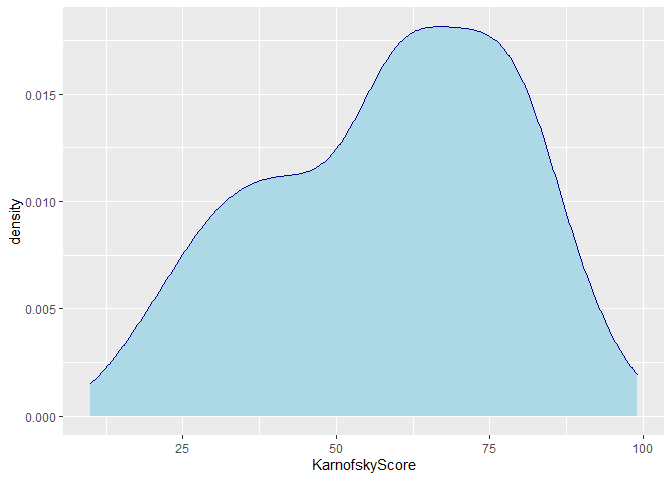
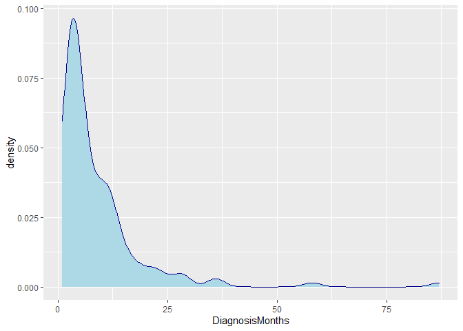
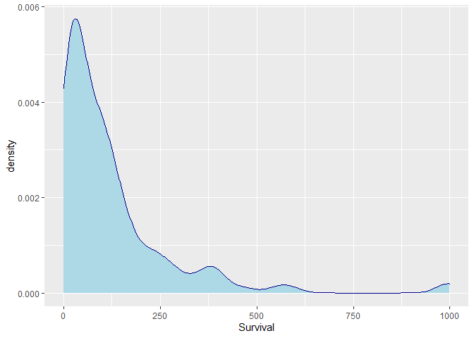
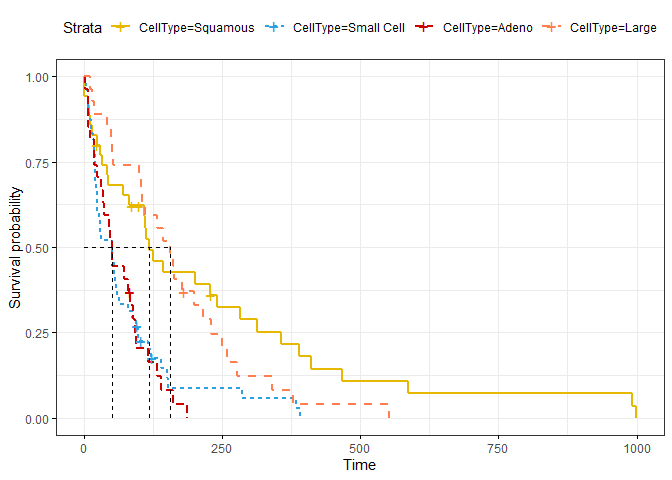

Lung Cancer
================

### Updating Libraries

``` r
library(rio)
library(formattable)
library(dplyr)
library(tidyverse)
library(readxl)
library(corrplot)
library(stargazer)
library(car)
library(PerformanceAnalytics)
library(tidyr)
library(tm)
library(MASS)
library(AER)
library(ggplot2)
library(lubridate)
library(lattice)
library(lme4)
library(MuMIn)
library(ggridges)
library(hrbrthemes)
library(survival)
library(survminer)
options(scipen = 999)
```

### Importing Data Set

``` r
df<-read_xlsx("Lung Cancer.xlsx",sheet = "Data")
str(df)
```

    ## tibble [137 x 8] (S3: tbl_df/tbl/data.frame)
    ##  $ Treatment      : num [1:137] 1 1 1 1 1 1 1 1 1 1 ...
    ##  $ CellType       : num [1:137] 1 1 1 1 1 1 1 1 1 1 ...
    ##  $ Survival       : num [1:137] 72 411 228 126 118 10 82 110 314 100 ...
    ##  $ Status         : num [1:137] 1 1 1 1 1 1 1 1 1 0 ...
    ##  $ KarnofskyScore : num [1:137] 60 70 60 60 70 20 40 80 50 70 ...
    ##  $ DiagnosisMonths: num [1:137] 7 5 3 9 11 5 10 29 18 6 ...
    ##  $ Age            : num [1:137] 69 64 38 63 65 49 69 68 43 70 ...
    ##  $ Chemo          : num [1:137] 0 10 0 10 10 0 10 0 0 0 ...

\#\#Converting to factor and releveling

``` r
df$Treatment<-as.factor(df$Treatment)

df$CellType<-as.factor(df$CellType)

#df$Status<-as.factor(df$Status)

df$Chemo<-as.factor(df$Chemo)
df$Chemo <- recode_factor(df$Chemo, "0" = "No", "10" = "Yes")

summary(df)
```

    ##  Treatment CellType    Survival         Status       KarnofskyScore 
    ##  1:69      1:35     Min.   :  1.0   Min.   :0.0000   Min.   :10.00  
    ##  2:68      2:48     1st Qu.: 25.0   1st Qu.:1.0000   1st Qu.:40.00  
    ##            3:27     Median : 80.0   Median :1.0000   Median :60.00  
    ##            4:27     Mean   :121.6   Mean   :0.9343   Mean   :58.57  
    ##                     3rd Qu.:144.0   3rd Qu.:1.0000   3rd Qu.:75.00  
    ##                     Max.   :999.0   Max.   :1.0000   Max.   :99.00  
    ##  DiagnosisMonths       Age        Chemo   
    ##  Min.   : 1.000   Min.   :34.00   No :97  
    ##  1st Qu.: 3.000   1st Qu.:51.00   Yes:40  
    ##  Median : 5.000   Median :62.00           
    ##  Mean   : 8.774   Mean   :58.31           
    ##  3rd Qu.:11.000   3rd Qu.:66.00           
    ##  Max.   :87.000   Max.   :81.00

``` r
ggplot(df, aes(x=KarnofskyScore))+
  geom_density(color="darkblue", fill="lightblue")
```

<!-- -->

``` r
ggplot(df, aes(x=DiagnosisMonths))+
  geom_density(color="darkgreen", fill="lightgreen")
```

<!-- -->

``` r
ggplot(df, aes(x=log(KarnofskyScore)))+
  geom_density(color="Red3", fill="Coral")
```

<!-- -->

``` r
ggplot(df, aes(x=Age))+
  geom_density(color="darkgreen", fill="lightgreen")
```

<!-- -->

``` r
ggplot(df, aes(x=log(Age)))+
  geom_density(color="darkblue", fill="lightblue")
```

<!-- -->

``` r
ggplot(df, aes(x=Survival))+
  geom_density(color="Red3", fill="Coral")
```

<!-- -->

``` r
ggplot(df, aes(x=log(Survival)))+
  geom_density(color="Red3", fill="Coral")
```

<!-- -->

``` r
y<-Surv(df$Survival,df$Status)
reg1<-survfit(formula=y~CellType,data=df)
reg1
```

    ## Call: survfit(formula = y ~ CellType, data = df)
    ## 
    ##             n events median 0.95LCL 0.95UCL
    ## CellType=1 35     31    118      82     314
    ## CellType=2 48     45     51      25      63
    ## CellType=3 27     26     51      35      92
    ## CellType=4 27     26    156     105     231

``` r
summary(reg1)
```

    ## Call: survfit(formula = y ~ CellType, data = df)
    ## 
    ##                 CellType=1 
    ##  time n.risk n.event survival std.err lower 95% CI upper 95% CI
    ##     1     35       2    0.943  0.0392       0.8690        1.000
    ##     8     33       1    0.914  0.0473       0.8261        1.000
    ##    10     32       1    0.886  0.0538       0.7863        0.998
    ##    11     31       1    0.857  0.0591       0.7487        0.981
    ##    15     30       1    0.829  0.0637       0.7127        0.963
    ##    25     29       1    0.800  0.0676       0.6779        0.944
    ##    30     27       1    0.770  0.0713       0.6426        0.924
    ##    33     26       1    0.741  0.0745       0.6083        0.902
    ##    42     25       1    0.711  0.0772       0.5749        0.880
    ##    44     24       1    0.681  0.0794       0.5423        0.856
    ##    72     23       1    0.652  0.0813       0.5105        0.832
    ##    82     22       1    0.622  0.0828       0.4793        0.808
    ##   110     19       1    0.589  0.0847       0.4448        0.781
    ##   111     18       1    0.557  0.0861       0.4112        0.754
    ##   112     17       1    0.524  0.0870       0.3784        0.726
    ##   118     16       1    0.491  0.0875       0.3464        0.697
    ##   126     15       1    0.458  0.0876       0.3152        0.667
    ##   144     14       1    0.426  0.0873       0.2849        0.636
    ##   201     13       1    0.393  0.0865       0.2553        0.605
    ##   228     12       1    0.360  0.0852       0.2265        0.573
    ##   242     10       1    0.324  0.0840       0.1951        0.539
    ##   283      9       1    0.288  0.0820       0.1650        0.503
    ##   314      8       1    0.252  0.0793       0.1362        0.467
    ##   357      7       1    0.216  0.0757       0.1088        0.429
    ##   389      6       1    0.180  0.0711       0.0831        0.391
    ##   411      5       1    0.144  0.0654       0.0592        0.351
    ##   467      4       1    0.108  0.0581       0.0377        0.310
    ##   587      3       1    0.072  0.0487       0.0192        0.271
    ##   991      2       1    0.036  0.0352       0.0053        0.245
    ##   999      1       1    0.000     NaN           NA           NA
    ## 
    ##                 CellType=2 
    ##  time n.risk n.event survival std.err lower 95% CI upper 95% CI
    ##     2     48       1   0.9792  0.0206      0.93958        1.000
    ##     4     47       1   0.9583  0.0288      0.90344        1.000
    ##     7     46       2   0.9167  0.0399      0.84172        0.998
    ##     8     44       1   0.8958  0.0441      0.81345        0.987
    ##    10     43       1   0.8750  0.0477      0.78627        0.974
    ##    13     42       2   0.8333  0.0538      0.73430        0.946
    ##    16     40       1   0.8125  0.0563      0.70926        0.931
    ##    18     39       2   0.7708  0.0607      0.66065        0.899
    ##    20     37       2   0.7292  0.0641      0.61369        0.866
    ##    21     35       2   0.6875  0.0669      0.56812        0.832
    ##    22     33       1   0.6667  0.0680      0.54580        0.814
    ##    24     32       1   0.6458  0.0690      0.52377        0.796
    ##    25     31       2   0.6042  0.0706      0.48052        0.760
    ##    27     29       1   0.5833  0.0712      0.45928        0.741
    ##    29     28       1   0.5625  0.0716      0.43830        0.722
    ##    30     27       1   0.5417  0.0719      0.41756        0.703
    ##    31     26       1   0.5208  0.0721      0.39706        0.683
    ##    51     25       2   0.4792  0.0721      0.35678        0.644
    ##    52     23       1   0.4583  0.0719      0.33699        0.623
    ##    54     22       2   0.4167  0.0712      0.29814        0.582
    ##    56     20       1   0.3958  0.0706      0.27908        0.561
    ##    59     19       1   0.3750  0.0699      0.26027        0.540
    ##    61     18       1   0.3542  0.0690      0.24171        0.519
    ##    63     17       1   0.3333  0.0680      0.22342        0.497
    ##    80     16       1   0.3125  0.0669      0.20541        0.475
    ##    87     15       1   0.2917  0.0656      0.18768        0.453
    ##    95     14       1   0.2708  0.0641      0.17026        0.431
    ##    99     12       2   0.2257  0.0609      0.13302        0.383
    ##   117      9       1   0.2006  0.0591      0.11267        0.357
    ##   122      8       1   0.1755  0.0567      0.09316        0.331
    ##   139      6       1   0.1463  0.0543      0.07066        0.303
    ##   151      5       1   0.1170  0.0507      0.05005        0.274
    ##   153      4       1   0.0878  0.0457      0.03163        0.244
    ##   287      3       1   0.0585  0.0387      0.01600        0.214
    ##   384      2       1   0.0293  0.0283      0.00438        0.195
    ##   392      1       1   0.0000     NaN           NA           NA
    ## 
    ##                 CellType=3 
    ##  time n.risk n.event survival std.err lower 95% CI upper 95% CI
    ##     3     27       1   0.9630  0.0363      0.89430        1.000
    ##     7     26       1   0.9259  0.0504      0.83223        1.000
    ##     8     25       2   0.8519  0.0684      0.72786        0.997
    ##    12     23       1   0.8148  0.0748      0.68071        0.975
    ##    18     22       1   0.7778  0.0800      0.63576        0.952
    ##    19     21       1   0.7407  0.0843      0.59259        0.926
    ##    24     20       1   0.7037  0.0879      0.55093        0.899
    ##    31     19       1   0.6667  0.0907      0.51059        0.870
    ##    35     18       1   0.6296  0.0929      0.47146        0.841
    ##    36     17       1   0.5926  0.0946      0.43344        0.810
    ##    45     16       1   0.5556  0.0956      0.39647        0.778
    ##    48     15       1   0.5185  0.0962      0.36050        0.746
    ##    51     14       1   0.4815  0.0962      0.32552        0.712
    ##    52     13       1   0.4444  0.0956      0.29152        0.678
    ##    73     12       1   0.4074  0.0946      0.25850        0.642
    ##    80     11       1   0.3704  0.0929      0.22649        0.606
    ##    84      9       1   0.3292  0.0913      0.19121        0.567
    ##    90      8       1   0.2881  0.0887      0.15759        0.527
    ##    92      7       1   0.2469  0.0850      0.12575        0.485
    ##    95      6       1   0.2058  0.0802      0.09587        0.442
    ##   117      5       1   0.1646  0.0740      0.06824        0.397
    ##   132      4       1   0.1235  0.0659      0.04335        0.352
    ##   140      3       1   0.0823  0.0553      0.02204        0.307
    ##   162      2       1   0.0412  0.0401      0.00608        0.279
    ##   186      1       1   0.0000     NaN           NA           NA
    ## 
    ##                 CellType=4 
    ##  time n.risk n.event survival std.err lower 95% CI upper 95% CI
    ##    12     27       1   0.9630  0.0363      0.89430        1.000
    ##    15     26       1   0.9259  0.0504      0.83223        1.000
    ##    19     25       1   0.8889  0.0605      0.77791        1.000
    ##    43     24       1   0.8519  0.0684      0.72786        0.997
    ##    49     23       1   0.8148  0.0748      0.68071        0.975
    ##    52     22       1   0.7778  0.0800      0.63576        0.952
    ##    53     21       1   0.7407  0.0843      0.59259        0.926
    ##   100     20       1   0.7037  0.0879      0.55093        0.899
    ##   103     19       1   0.6667  0.0907      0.51059        0.870
    ##   105     18       1   0.6296  0.0929      0.47146        0.841
    ##   111     17       1   0.5926  0.0946      0.43344        0.810
    ##   133     16       1   0.5556  0.0956      0.39647        0.778
    ##   143     15       1   0.5185  0.0962      0.36050        0.746
    ##   156     14       1   0.4815  0.0962      0.32552        0.712
    ##   162     13       1   0.4444  0.0956      0.29152        0.678
    ##   164     12       1   0.4074  0.0946      0.25850        0.642
    ##   177     11       1   0.3704  0.0929      0.22649        0.606
    ##   200      9       1   0.3292  0.0913      0.19121        0.567
    ##   216      8       1   0.2881  0.0887      0.15759        0.527
    ##   231      7       1   0.2469  0.0850      0.12575        0.485
    ##   250      6       1   0.2058  0.0802      0.09587        0.442
    ##   260      5       1   0.1646  0.0740      0.06824        0.397
    ##   278      4       1   0.1235  0.0659      0.04335        0.352
    ##   340      3       1   0.0823  0.0553      0.02204        0.307
    ##   378      2       1   0.0412  0.0401      0.00608        0.279
    ##   553      1       1   0.0000     NaN           NA           NA

``` r
plot(reg1)
```

<!-- -->

``` r
#df$Status<-as.numeric(df$Status)
ggsurvplot(fit= reg1, data=df, 
          pval = FALSE, conf.int = FALSE,
          risk.table = TRUE, # Add risk table
          #risk.table.col = "strata", # Change risk table color by groups
          linetype = "strata", # Change line type by groups
          surv.median.line = "hv", # Specify median survival
          ggtheme = theme_bw(), # Change ggplot2 theme
          palette = c("#E7B800", "#2E9FDF","Red3","Coral"))
```

<!-- -->
