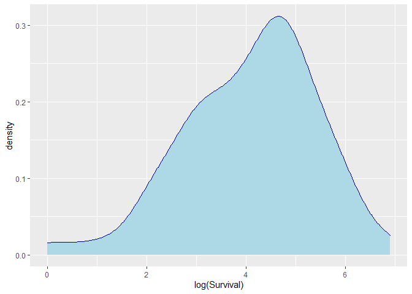

Lung Cancer
================

### Updating Libraries

``` r
library(rio)
library(formattable)
library(dplyr)
library(tidyverse)
library(readxl)
library(corrplot)
library(stargazer)
library(car)
library(PerformanceAnalytics)
library(tidyr)
library(tm)
library(MASS)
library(AER)
library(ggplot2)
library(lubridate)
library(lattice)
library(lme4)
library(MuMIn)
library(ggridges)
library(hrbrthemes)
library(survival)
library(survminer)
options(scipen = 999)
```

### Importing Data Set

``` r
df<-read_xlsx("Lung Cancer.xlsx",sheet = "Data")
str(df)
```

    ## tibble [137 x 8] (S3: tbl_df/tbl/data.frame)
    ##  $ Treatment      : num [1:137] 1 1 1 1 1 1 1 1 1 1 ...
    ##  $ CellType       : num [1:137] 1 1 1 1 1 1 1 1 1 1 ...
    ##  $ Survival       : num [1:137] 72 411 228 126 118 10 82 110 314 100 ...
    ##  $ Status         : num [1:137] 1 1 1 1 1 1 1 1 1 0 ...
    ##  $ KarnofskyScore : num [1:137] 60 70 60 60 70 20 40 80 50 70 ...
    ##  $ DiagnosisMonths: num [1:137] 7 5 3 9 11 5 10 29 18 6 ...
    ##  $ Age            : num [1:137] 69 64 38 63 65 49 69 68 43 70 ...
    ##  $ Chemo          : num [1:137] 0 10 0 10 10 0 10 0 0 0 ...

\#\#Converting to factor and releveling

``` r
df$Treatment<-as.factor(df$Treatment)

df$CellType<-as.factor(df$CellType)

#df$Status<-as.factor(df$Status)

df$Chemo<-as.factor(df$Chemo)
df$Chemo <- recode_factor(df$Chemo, "0" = "No", "10" = "Yes")
df$Treatment <- recode_factor(df$Treatment, "1" = "Standard", "2" = "New Drug")
df$CellType <- recode_factor(df$CellType, "1" = "Squamous", "2" = "Small Cell", "3" = "Adeno", "4" = "Large")
df$logDiagnosisMonths<-log(df$DiagnosisMonths)

summary(df)
```

    ##     Treatment        CellType     Survival         Status      
    ##  Standard:69   Squamous  :35   Min.   :  1.0   Min.   :0.0000  
    ##  New Drug:68   Small Cell:48   1st Qu.: 25.0   1st Qu.:1.0000  
    ##                Adeno     :27   Median : 80.0   Median :1.0000  
    ##                Large     :27   Mean   :121.6   Mean   :0.9343  
    ##                                3rd Qu.:144.0   3rd Qu.:1.0000  
    ##                                Max.   :999.0   Max.   :1.0000  
    ##  KarnofskyScore  DiagnosisMonths       Age        Chemo   
    ##  Min.   :10.00   Min.   : 1.000   Min.   :34.00   No :97  
    ##  1st Qu.:40.00   1st Qu.: 3.000   1st Qu.:51.00   Yes:40  
    ##  Median :60.00   Median : 5.000   Median :62.00           
    ##  Mean   :58.57   Mean   : 8.774   Mean   :58.31           
    ##  3rd Qu.:75.00   3rd Qu.:11.000   3rd Qu.:66.00           
    ##  Max.   :99.00   Max.   :87.000   Max.   :81.00           
    ##  logDiagnosisMonths
    ##  Min.   :0.000     
    ##  1st Qu.:1.099     
    ##  Median :1.609     
    ##  Mean   :1.753     
    ##  3rd Qu.:2.398     
    ##  Max.   :4.466

## Checking distributions

``` r
ggplot(df, aes(x=KarnofskyScore))+
  geom_density(color="darkblue", fill="lightblue")
```

<!-- -->

``` r
ggplot(df, aes(x=DiagnosisMonths))+
  geom_density(color="darkblue", fill="lightblue")
```

<!-- -->

``` r
ggplot(df, aes(x=log(KarnofskyScore)))+
  geom_density(color="darkblue", fill="lightblue")
```

<!-- -->

``` r
ggplot(df, aes(x=Age))+
  geom_density(color="darkblue", fill="lightblue")
```

<!-- -->

``` r
ggplot(df, aes(x=log(Age)))+
  geom_density(color="darkblue", fill="lightblue")
```

<!-- -->

``` r
ggplot(df, aes(x=Survival))+
  geom_density(color="darkblue", fill="lightblue")
```

<!-- -->

``` r
ggplot(df, aes(x=log(Survival)))+
  geom_density(color="darkblue", fill="lightblue")
```

<!-- -->

## Running non-parametric model- Cell type

``` r
y<-Surv(df$Survival,df$Status)
reg1<-survfit(formula=y~CellType,data=df)
reg1
```

    ## Call: survfit(formula = y ~ CellType, data = df)
    ## 
    ##                      n events median 0.95LCL 0.95UCL
    ## CellType=Squamous   35     31    118      82     314
    ## CellType=Small Cell 48     45     51      25      63
    ## CellType=Adeno      27     26     51      35      92
    ## CellType=Large      27     26    156     105     231

``` r
summary(reg1)
```

    ## Call: survfit(formula = y ~ CellType, data = df)
    ## 
    ##                 CellType=Squamous 
    ##  time n.risk n.event survival std.err lower 95% CI upper 95% CI
    ##     1     35       2    0.943  0.0392       0.8690        1.000
    ##     8     33       1    0.914  0.0473       0.8261        1.000
    ##    10     32       1    0.886  0.0538       0.7863        0.998
    ##    11     31       1    0.857  0.0591       0.7487        0.981
    ##    15     30       1    0.829  0.0637       0.7127        0.963
    ##    25     29       1    0.800  0.0676       0.6779        0.944
    ##    30     27       1    0.770  0.0713       0.6426        0.924
    ##    33     26       1    0.741  0.0745       0.6083        0.902
    ##    42     25       1    0.711  0.0772       0.5749        0.880
    ##    44     24       1    0.681  0.0794       0.5423        0.856
    ##    72     23       1    0.652  0.0813       0.5105        0.832
    ##    82     22       1    0.622  0.0828       0.4793        0.808
    ##   110     19       1    0.589  0.0847       0.4448        0.781
    ##   111     18       1    0.557  0.0861       0.4112        0.754
    ##   112     17       1    0.524  0.0870       0.3784        0.726
    ##   118     16       1    0.491  0.0875       0.3464        0.697
    ##   126     15       1    0.458  0.0876       0.3152        0.667
    ##   144     14       1    0.426  0.0873       0.2849        0.636
    ##   201     13       1    0.393  0.0865       0.2553        0.605
    ##   228     12       1    0.360  0.0852       0.2265        0.573
    ##   242     10       1    0.324  0.0840       0.1951        0.539
    ##   283      9       1    0.288  0.0820       0.1650        0.503
    ##   314      8       1    0.252  0.0793       0.1362        0.467
    ##   357      7       1    0.216  0.0757       0.1088        0.429
    ##   389      6       1    0.180  0.0711       0.0831        0.391
    ##   411      5       1    0.144  0.0654       0.0592        0.351
    ##   467      4       1    0.108  0.0581       0.0377        0.310
    ##   587      3       1    0.072  0.0487       0.0192        0.271
    ##   991      2       1    0.036  0.0352       0.0053        0.245
    ##   999      1       1    0.000     NaN           NA           NA
    ## 
    ##                 CellType=Small Cell 
    ##  time n.risk n.event survival std.err lower 95% CI upper 95% CI
    ##     2     48       1   0.9792  0.0206      0.93958        1.000
    ##     4     47       1   0.9583  0.0288      0.90344        1.000
    ##     7     46       2   0.9167  0.0399      0.84172        0.998
    ##     8     44       1   0.8958  0.0441      0.81345        0.987
    ##    10     43       1   0.8750  0.0477      0.78627        0.974
    ##    13     42       2   0.8333  0.0538      0.73430        0.946
    ##    16     40       1   0.8125  0.0563      0.70926        0.931
    ##    18     39       2   0.7708  0.0607      0.66065        0.899
    ##    20     37       2   0.7292  0.0641      0.61369        0.866
    ##    21     35       2   0.6875  0.0669      0.56812        0.832
    ##    22     33       1   0.6667  0.0680      0.54580        0.814
    ##    24     32       1   0.6458  0.0690      0.52377        0.796
    ##    25     31       2   0.6042  0.0706      0.48052        0.760
    ##    27     29       1   0.5833  0.0712      0.45928        0.741
    ##    29     28       1   0.5625  0.0716      0.43830        0.722
    ##    30     27       1   0.5417  0.0719      0.41756        0.703
    ##    31     26       1   0.5208  0.0721      0.39706        0.683
    ##    51     25       2   0.4792  0.0721      0.35678        0.644
    ##    52     23       1   0.4583  0.0719      0.33699        0.623
    ##    54     22       2   0.4167  0.0712      0.29814        0.582
    ##    56     20       1   0.3958  0.0706      0.27908        0.561
    ##    59     19       1   0.3750  0.0699      0.26027        0.540
    ##    61     18       1   0.3542  0.0690      0.24171        0.519
    ##    63     17       1   0.3333  0.0680      0.22342        0.497
    ##    80     16       1   0.3125  0.0669      0.20541        0.475
    ##    87     15       1   0.2917  0.0656      0.18768        0.453
    ##    95     14       1   0.2708  0.0641      0.17026        0.431
    ##    99     12       2   0.2257  0.0609      0.13302        0.383
    ##   117      9       1   0.2006  0.0591      0.11267        0.357
    ##   122      8       1   0.1755  0.0567      0.09316        0.331
    ##   139      6       1   0.1463  0.0543      0.07066        0.303
    ##   151      5       1   0.1170  0.0507      0.05005        0.274
    ##   153      4       1   0.0878  0.0457      0.03163        0.244
    ##   287      3       1   0.0585  0.0387      0.01600        0.214
    ##   384      2       1   0.0293  0.0283      0.00438        0.195
    ##   392      1       1   0.0000     NaN           NA           NA
    ## 
    ##                 CellType=Adeno 
    ##  time n.risk n.event survival std.err lower 95% CI upper 95% CI
    ##     3     27       1   0.9630  0.0363      0.89430        1.000
    ##     7     26       1   0.9259  0.0504      0.83223        1.000
    ##     8     25       2   0.8519  0.0684      0.72786        0.997
    ##    12     23       1   0.8148  0.0748      0.68071        0.975
    ##    18     22       1   0.7778  0.0800      0.63576        0.952
    ##    19     21       1   0.7407  0.0843      0.59259        0.926
    ##    24     20       1   0.7037  0.0879      0.55093        0.899
    ##    31     19       1   0.6667  0.0907      0.51059        0.870
    ##    35     18       1   0.6296  0.0929      0.47146        0.841
    ##    36     17       1   0.5926  0.0946      0.43344        0.810
    ##    45     16       1   0.5556  0.0956      0.39647        0.778
    ##    48     15       1   0.5185  0.0962      0.36050        0.746
    ##    51     14       1   0.4815  0.0962      0.32552        0.712
    ##    52     13       1   0.4444  0.0956      0.29152        0.678
    ##    73     12       1   0.4074  0.0946      0.25850        0.642
    ##    80     11       1   0.3704  0.0929      0.22649        0.606
    ##    84      9       1   0.3292  0.0913      0.19121        0.567
    ##    90      8       1   0.2881  0.0887      0.15759        0.527
    ##    92      7       1   0.2469  0.0850      0.12575        0.485
    ##    95      6       1   0.2058  0.0802      0.09587        0.442
    ##   117      5       1   0.1646  0.0740      0.06824        0.397
    ##   132      4       1   0.1235  0.0659      0.04335        0.352
    ##   140      3       1   0.0823  0.0553      0.02204        0.307
    ##   162      2       1   0.0412  0.0401      0.00608        0.279
    ##   186      1       1   0.0000     NaN           NA           NA
    ## 
    ##                 CellType=Large 
    ##  time n.risk n.event survival std.err lower 95% CI upper 95% CI
    ##    12     27       1   0.9630  0.0363      0.89430        1.000
    ##    15     26       1   0.9259  0.0504      0.83223        1.000
    ##    19     25       1   0.8889  0.0605      0.77791        1.000
    ##    43     24       1   0.8519  0.0684      0.72786        0.997
    ##    49     23       1   0.8148  0.0748      0.68071        0.975
    ##    52     22       1   0.7778  0.0800      0.63576        0.952
    ##    53     21       1   0.7407  0.0843      0.59259        0.926
    ##   100     20       1   0.7037  0.0879      0.55093        0.899
    ##   103     19       1   0.6667  0.0907      0.51059        0.870
    ##   105     18       1   0.6296  0.0929      0.47146        0.841
    ##   111     17       1   0.5926  0.0946      0.43344        0.810
    ##   133     16       1   0.5556  0.0956      0.39647        0.778
    ##   143     15       1   0.5185  0.0962      0.36050        0.746
    ##   156     14       1   0.4815  0.0962      0.32552        0.712
    ##   162     13       1   0.4444  0.0956      0.29152        0.678
    ##   164     12       1   0.4074  0.0946      0.25850        0.642
    ##   177     11       1   0.3704  0.0929      0.22649        0.606
    ##   200      9       1   0.3292  0.0913      0.19121        0.567
    ##   216      8       1   0.2881  0.0887      0.15759        0.527
    ##   231      7       1   0.2469  0.0850      0.12575        0.485
    ##   250      6       1   0.2058  0.0802      0.09587        0.442
    ##   260      5       1   0.1646  0.0740      0.06824        0.397
    ##   278      4       1   0.1235  0.0659      0.04335        0.352
    ##   340      3       1   0.0823  0.0553      0.02204        0.307
    ##   378      2       1   0.0412  0.0401      0.00608        0.279
    ##   553      1       1   0.0000     NaN           NA           NA

``` r
#df$Status<-as.numeric(df$Status)
ggsurvplot(fit= reg1, data=df, 
          pval = FALSE, conf.int = FALSE,
          #risk.table = TRUE, # Add risk table
          #risk.table.col = "strata", # Change risk table color by groups
          linetype = "strata", # Change line type by groups
          surv.median.line = "hv", # Specify median survival
          ggtheme = theme_bw(), # Change ggplot2 theme
          palette = c("#E7B800", "#2E9FDF","Red3","Coral"))
```

<!-- -->

## Running non-parametric model- Treatment

``` r
reg2<-survfit(formula=y~Treatment,data=df)
summary(reg2)
```

    ## Call: survfit(formula = y ~ Treatment, data = df)
    ## 
    ##                 Treatment=Standard 
    ##  time n.risk n.event survival std.err lower 95% CI upper 95% CI
    ##     3     69       1   0.9855  0.0144      0.95771        1.000
    ##     4     68       1   0.9710  0.0202      0.93223        1.000
    ##     7     67       1   0.9565  0.0246      0.90959        1.000
    ##     8     66       2   0.9275  0.0312      0.86834        0.991
    ##    10     64       2   0.8986  0.0363      0.83006        0.973
    ##    11     62       1   0.8841  0.0385      0.81165        0.963
    ##    12     61       2   0.8551  0.0424      0.77592        0.942
    ##    13     59       1   0.8406  0.0441      0.75849        0.932
    ##    16     58       1   0.8261  0.0456      0.74132        0.921
    ##    18     57       2   0.7971  0.0484      0.70764        0.898
    ##    20     55       1   0.7826  0.0497      0.69109        0.886
    ##    21     54       1   0.7681  0.0508      0.67472        0.874
    ##    22     53       1   0.7536  0.0519      0.65851        0.862
    ##    27     51       1   0.7388  0.0529      0.64208        0.850
    ##    30     50       1   0.7241  0.0539      0.62580        0.838
    ##    31     49       1   0.7093  0.0548      0.60967        0.825
    ##    35     48       1   0.6945  0.0556      0.59368        0.812
    ##    42     47       1   0.6797  0.0563      0.57782        0.800
    ##    51     46       1   0.6650  0.0570      0.56209        0.787
    ##    52     45       1   0.6502  0.0576      0.54649        0.774
    ##    54     44       2   0.6206  0.0587      0.51565        0.747
    ##    56     42       1   0.6059  0.0591      0.50040        0.734
    ##    59     41       1   0.5911  0.0595      0.48526        0.720
    ##    63     40       1   0.5763  0.0598      0.47023        0.706
    ##    72     39       1   0.5615  0.0601      0.45530        0.693
    ##    82     38       1   0.5467  0.0603      0.44049        0.679
    ##    92     37       1   0.5320  0.0604      0.42577        0.665
    ##    95     36       1   0.5172  0.0605      0.41116        0.651
    ##   100     34       1   0.5020  0.0606      0.39615        0.636
    ##   103     32       1   0.4863  0.0607      0.38070        0.621
    ##   105     31       1   0.4706  0.0608      0.36537        0.606
    ##   110     30       1   0.4549  0.0607      0.35018        0.591
    ##   117     29       2   0.4235  0.0605      0.32017        0.560
    ##   118     27       1   0.4079  0.0602      0.30537        0.545
    ##   122     26       1   0.3922  0.0599      0.29069        0.529
    ##   126     24       1   0.3758  0.0596      0.27542        0.513
    ##   132     23       1   0.3595  0.0592      0.26031        0.496
    ##   139     22       1   0.3432  0.0587      0.24535        0.480
    ##   143     21       1   0.3268  0.0582      0.23057        0.463
    ##   144     20       1   0.3105  0.0575      0.21595        0.446
    ##   151     19       1   0.2941  0.0568      0.20151        0.429
    ##   153     18       1   0.2778  0.0559      0.18725        0.412
    ##   156     17       1   0.2614  0.0550      0.17317        0.395
    ##   162     16       2   0.2288  0.0527      0.14563        0.359
    ##   177     14       1   0.2124  0.0514      0.13218        0.341
    ##   200     12       1   0.1947  0.0501      0.11761        0.322
    ##   216     11       1   0.1770  0.0486      0.10340        0.303
    ##   228     10       1   0.1593  0.0468      0.08956        0.283
    ##   250      9       1   0.1416  0.0448      0.07614        0.263
    ##   260      8       1   0.1239  0.0426      0.06318        0.243
    ##   278      7       1   0.1062  0.0400      0.05076        0.222
    ##   287      6       1   0.0885  0.0371      0.03896        0.201
    ##   314      5       1   0.0708  0.0336      0.02793        0.180
    ##   384      4       1   0.0531  0.0295      0.01788        0.158
    ##   392      3       1   0.0354  0.0244      0.00917        0.137
    ##   411      2       1   0.0177  0.0175      0.00256        0.123
    ##   553      1       1   0.0000     NaN           NA           NA
    ## 
    ##                 Treatment=New Drug 
    ##  time n.risk n.event survival std.err lower 95% CI upper 95% CI
    ##     1     68       2   0.9706  0.0205      0.93125        1.000
    ##     2     66       1   0.9559  0.0249      0.90830        1.000
    ##     7     65       2   0.9265  0.0317      0.86647        0.991
    ##     8     63       2   0.8971  0.0369      0.82766        0.972
    ##    13     61       1   0.8824  0.0391      0.80900        0.962
    ##    15     60       2   0.8529  0.0429      0.77278        0.941
    ##    18     58       1   0.8382  0.0447      0.75513        0.930
    ##    19     57       2   0.8088  0.0477      0.72056        0.908
    ##    20     55       1   0.7941  0.0490      0.70360        0.896
    ##    21     54       1   0.7794  0.0503      0.68684        0.884
    ##    24     53       2   0.7500  0.0525      0.65383        0.860
    ##    25     51       3   0.7059  0.0553      0.60548        0.823
    ##    29     48       1   0.6912  0.0560      0.58964        0.810
    ##    30     47       1   0.6765  0.0567      0.57394        0.797
    ##    31     46       1   0.6618  0.0574      0.55835        0.784
    ##    33     45       1   0.6471  0.0580      0.54289        0.771
    ##    36     44       1   0.6324  0.0585      0.52754        0.758
    ##    43     43       1   0.6176  0.0589      0.51230        0.745
    ##    44     42       1   0.6029  0.0593      0.49717        0.731
    ##    45     41       1   0.5882  0.0597      0.48216        0.718
    ##    48     40       1   0.5735  0.0600      0.46724        0.704
    ##    49     39       1   0.5588  0.0602      0.45244        0.690
    ##    51     38       2   0.5294  0.0605      0.42313        0.662
    ##    52     36       2   0.5000  0.0606      0.39423        0.634
    ##    53     34       1   0.4853  0.0606      0.37993        0.620
    ##    61     33       1   0.4706  0.0605      0.36573        0.606
    ##    73     32       1   0.4559  0.0604      0.35163        0.591
    ##    80     31       2   0.4265  0.0600      0.32373        0.562
    ##    84     28       1   0.4112  0.0597      0.30935        0.547
    ##    87     27       1   0.3960  0.0594      0.29509        0.531
    ##    90     25       1   0.3802  0.0591      0.28028        0.516
    ##    95     24       1   0.3643  0.0587      0.26560        0.500
    ##    99     23       2   0.3326  0.0578      0.23670        0.467
    ##   111     20       2   0.2994  0.0566      0.20673        0.434
    ##   112     18       1   0.2827  0.0558      0.19203        0.416
    ##   133     17       1   0.2661  0.0550      0.17754        0.399
    ##   140     16       1   0.2495  0.0540      0.16326        0.381
    ##   164     15       1   0.2329  0.0529      0.14920        0.363
    ##   186     14       1   0.2162  0.0517      0.13538        0.345
    ##   201     13       1   0.1996  0.0503      0.12181        0.327
    ##   231     12       1   0.1830  0.0488      0.10851        0.308
    ##   242     10       1   0.1647  0.0472      0.09389        0.289
    ##   283      9       1   0.1464  0.0454      0.07973        0.269
    ##   340      8       1   0.1281  0.0432      0.06609        0.248
    ##   357      7       1   0.1098  0.0407      0.05304        0.227
    ##   378      6       1   0.0915  0.0378      0.04067        0.206
    ##   389      5       1   0.0732  0.0344      0.02912        0.184
    ##   467      4       1   0.0549  0.0303      0.01861        0.162
    ##   587      3       1   0.0366  0.0251      0.00953        0.140
    ##   991      2       1   0.0183  0.0180      0.00265        0.126
    ##   999      1       1   0.0000     NaN           NA           NA

``` r
ggsurvplot(fit= reg2, data=df, 
          pval = FALSE, conf.int = FALSE,
          #risk.table = TRUE, # Add risk table
          #risk.table.col = "strata", # Change risk table color by groups
          linetype = "strata", # Change line type by groups
          surv.median.line = "hv", # Specify median survival
          ggtheme = theme_bw(), # Change ggplot2 theme
          palette = c("#2E9FDF","Red3"),
          xlab="Time in days",title="Kaplan-Meier Curve for Lung Cancer Survival",
          legend.labs=c("Standard Treatment", "New Drug"), 
          legend.title="Treatment Type")
```

<!-- -->

## Checking probablity to survive 6 months and a year

``` r
summary(reg2,times = 365)
```

    ## Call: survfit(formula = y ~ Treatment, data = df)
    ## 
    ##                 Treatment=Standard 
    ##         time       n.risk      n.event     survival      std.err 
    ##     365.0000       4.0000      60.0000       0.0708       0.0336 
    ## lower 95% CI upper 95% CI 
    ##       0.0279       0.1795 
    ## 
    ##                 Treatment=New Drug 
    ##         time       n.risk      n.event     survival      std.err 
    ##     365.0000       6.0000      58.0000       0.1098       0.0407 
    ## lower 95% CI upper 95% CI 
    ##       0.0530       0.2272

``` r
summary(reg2,times = 183)
```

    ## Call: survfit(formula = y ~ Treatment, data = df)
    ## 
    ##                 Treatment=Standard 
    ##         time       n.risk      n.event     survival      std.err 
    ##     183.0000      12.0000      52.0000       0.2124       0.0514 
    ## lower 95% CI upper 95% CI 
    ##       0.1322       0.3414 
    ## 
    ##                 Treatment=New Drug 
    ##         time       n.risk      n.event     survival      std.err 
    ##     183.0000      14.0000      51.0000       0.2329       0.0529 
    ## lower 95% CI upper 95% CI 
    ##       0.1492       0.3634

``` r
summary(reg2)$table
```

    ##                    records n.max n.start events   *rmean *se(rmean) median
    ## Treatment=Standard      69    69      69     64 123.9282   14.84352  103.0
    ## Treatment=New Drug      68    68      68     64 142.0613   26.81071   52.5
    ##                    0.95LCL 0.95UCL
    ## Treatment=Standard      59     132
    ## Treatment=New Drug      44      95

## Semi-parametric model - With Chemo

``` r
reg3<-coxph(y~Treatment+CellType+Age+KarnofskyScore+DiagnosisMonths+Chemo,data=df)
summary(reg3)
```

    ## Call:
    ## coxph(formula = y ~ Treatment + CellType + Age + KarnofskyScore + 
    ##     DiagnosisMonths + Chemo, data = df)
    ## 
    ##   n= 137, number of events= 128 
    ## 
    ##                           coef   exp(coef)    se(coef)      z
    ## TreatmentNew Drug   0.29460282  1.34259300  0.20754960  1.419
    ## CellTypeSmall Cell  0.86156046  2.36685120  0.27528447  3.130
    ## CellTypeAdeno       1.19606637  3.30708248  0.30091699  3.975
    ## CellTypeLarge       0.40129165  1.49375286  0.28268864  1.420
    ## Age                -0.00870647  0.99133132  0.00930030 -0.936
    ## KarnofskyScore     -0.03281533  0.96771726  0.00550776 -5.958
    ## DiagnosisMonths     0.00008132  1.00008132  0.00913606  0.009
    ## ChemoYes            0.07159360  1.07421869  0.23230538  0.308
    ##                         Pr(>|z|)    
    ## TreatmentNew Drug        0.15577    
    ## CellTypeSmall Cell       0.00175 ** 
    ## CellTypeAdeno      0.00007045662 ***
    ## CellTypeLarge            0.15574    
    ## Age                      0.34920    
    ## KarnofskyScore     0.00000000255 ***
    ## DiagnosisMonths          0.99290    
    ## ChemoYes                 0.75794    
    ## ---
    ## Signif. codes:  0 '***' 0.001 '**' 0.01 '*' 0.05 '.' 0.1 ' ' 1
    ## 
    ##                    exp(coef) exp(-coef) lower .95 upper .95
    ## TreatmentNew Drug     1.3426     0.7448    0.8939    2.0166
    ## CellTypeSmall Cell    2.3669     0.4225    1.3799    4.0597
    ## CellTypeAdeno         3.3071     0.3024    1.8336    5.9647
    ## CellTypeLarge         1.4938     0.6695    0.8583    2.5996
    ## Age                   0.9913     1.0087    0.9734    1.0096
    ## KarnofskyScore        0.9677     1.0334    0.9573    0.9782
    ## DiagnosisMonths       1.0001     0.9999    0.9823    1.0182
    ## ChemoYes              1.0742     0.9309    0.6813    1.6937
    ## 
    ## Concordance= 0.736  (se = 0.021 )
    ## Likelihood ratio test= 62.1  on 8 df,   p=0.0000000002
    ## Wald test            = 62.37  on 8 df,   p=0.0000000002
    ## Score (logrank) test = 66.74  on 8 df,   p=0.00000000002

## Model without Chemo

``` r
reg5<-coxph(y~Treatment+CellType+Age+KarnofskyScore+DiagnosisMonths,data=df)
summary(reg5)
```

    ## Call:
    ## coxph(formula = y ~ Treatment + CellType + Age + KarnofskyScore + 
    ##     DiagnosisMonths, data = df)
    ## 
    ##   n= 137, number of events= 128 
    ## 
    ##                         coef exp(coef)  se(coef)      z      Pr(>|z|)    
    ## TreatmentNew Drug   0.298380  1.347674  0.207503  1.438       0.15045    
    ## CellTypeSmall Cell  0.851206  2.342471  0.273011  3.118       0.00182 ** 
    ## CellTypeAdeno       1.183667  3.266330  0.297896  3.973 0.00007084859 ***
    ## CellTypeLarge       0.401001  1.493318  0.282665  1.419       0.15600    
    ## Age                -0.008706  0.991332  0.009309 -0.935       0.34971    
    ## KarnofskyScore     -0.032586  0.967940  0.005447 -5.982 0.00000000221 ***
    ## DiagnosisMonths     0.001339  1.001340  0.008066  0.166       0.86814    
    ## ---
    ## Signif. codes:  0 '***' 0.001 '**' 0.01 '*' 0.05 '.' 0.1 ' ' 1
    ## 
    ##                    exp(coef) exp(-coef) lower .95 upper .95
    ## TreatmentNew Drug     1.3477     0.7420    0.8973    2.0240
    ## CellTypeSmall Cell    2.3425     0.4269    1.3718    4.0000
    ## CellTypeAdeno         3.2663     0.3062    1.8218    5.8564
    ## CellTypeLarge         1.4933     0.6696    0.8581    2.5987
    ## Age                   0.9913     1.0087    0.9734    1.0096
    ## KarnofskyScore        0.9679     1.0331    0.9577    0.9783
    ## DiagnosisMonths       1.0013     0.9987    0.9856    1.0173
    ## 
    ## Concordance= 0.738  (se = 0.021 )
    ## Likelihood ratio test= 62.01  on 7 df,   p=0.00000000006
    ## Wald test            = 62.41  on 7 df,   p=0.00000000005
    ## Score (logrank) test = 66.74  on 7 df,   p=0.000000000007

``` r
anova(reg3,reg5)
```

    ## Analysis of Deviance Table
    ##  Cox model: response is  y
    ##  Model 1: ~ Treatment + CellType + Age + KarnofskyScore + DiagnosisMonths + Chemo
    ##  Model 2: ~ Treatment + CellType + Age + KarnofskyScore + DiagnosisMonths
    ##    loglik  Chisq Df P(>|Chi|)
    ## 1 -474.40                    
    ## 2 -474.44 0.0943  1    0.7588

## Model without Karnofsky score

``` r
reg6<-coxph(y~Treatment+CellType+Age+DiagnosisMonths,data=df)
summary(reg6)
```

    ## Call:
    ## coxph(formula = y ~ Treatment + CellType + Age + DiagnosisMonths, 
    ##     data = df)
    ## 
    ##   n= 137, number of events= 128 
    ## 
    ##                        coef exp(coef) se(coef)     z  Pr(>|z|)    
    ## TreatmentNew Drug  0.164098  1.178330 0.201281 0.815  0.414917    
    ## CellTypeSmall Cell 1.051322  2.861431 0.275512 3.816  0.000136 ***
    ## CellTypeAdeno      1.200909  3.323138 0.296260 4.054 0.0000504 ***
    ## CellTypeLarge      0.290214  1.336714 0.285296 1.017  0.309040    
    ## Age                0.004999  1.005011 0.009631 0.519  0.603765    
    ## DiagnosisMonths    0.008860  1.008900 0.008408 1.054  0.291998    
    ## ---
    ## Signif. codes:  0 '***' 0.001 '**' 0.01 '*' 0.05 '.' 0.1 ' ' 1
    ## 
    ##                    exp(coef) exp(-coef) lower .95 upper .95
    ## TreatmentNew Drug      1.178     0.8487    0.7942     1.748
    ## CellTypeSmall Cell     2.861     0.3495    1.6675     4.910
    ## CellTypeAdeno          3.323     0.3009    1.8594     5.939
    ## CellTypeLarge          1.337     0.7481    0.7642     2.338
    ## Age                    1.005     0.9950    0.9862     1.024
    ## DiagnosisMonths        1.009     0.9912    0.9924     1.026
    ## 
    ## Concordance= 0.629  (se = 0.028 )
    ## Likelihood ratio test= 27.03  on 6 df,   p=0.0001
    ## Wald test            = 26.37  on 6 df,   p=0.0002
    ## Score (logrank) test = 27.94  on 6 df,   p=0.0001

``` r
anova(reg5,reg6)
```

    ## Analysis of Deviance Table
    ##  Cox model: response is  y
    ##  Model 1: ~ Treatment + CellType + Age + KarnofskyScore + DiagnosisMonths
    ##  Model 2: ~ Treatment + CellType + Age + DiagnosisMonths
    ##    loglik  Chisq Df      P(>|Chi|)    
    ## 1 -474.44                             
    ## 2 -491.94 34.982  1 0.000000003327 ***
    ## ---
    ## Signif. codes:  0 '***' 0.001 '**' 0.01 '*' 0.05 '.' 0.1 ' ' 1

## Assessing Propotional Hazards

``` r
zph<-cox.zph(reg5)
zph
```

    ##                    chisq df       p
    ## Treatment        0.29350  1 0.58799
    ## CellType        14.85061  3 0.00195
    ## Age              1.87662  1 0.17072
    ## KarnofskyScore  12.97630  1 0.00032
    ## DiagnosisMonths  0.00114  1 0.97306
    ## GLOBAL          29.80760  7 0.00010

``` r
plot(zph)
```

<!-- --><!-- --><!-- --><!-- --><!-- -->

``` r
reg7<-coxph(y~Treatment+Age+DiagnosisMonths,data=df)
```

## Parametric Models

### Exponential Model

``` r
exp<-survreg(y~Treatment+Age+DiagnosisMonths,data=df,dist = "exponential")
summary(exp)
```

    ## 
    ## Call:
    ## survreg(formula = y ~ Treatment + Age + DiagnosisMonths, data = df, 
    ##     dist = "exponential")
    ##                      Value Std. Error     z                   p
    ## (Intercept)        5.73468    0.58776  9.76 <0.0000000000000002
    ## TreatmentNew Drug  0.11467    0.17737  0.65                0.52
    ## Age               -0.01437    0.00979 -1.47                0.14
    ## DiagnosisMonths   -0.01081    0.00931 -1.16                0.25
    ## 
    ## Scale fixed at 1 
    ## 
    ## Exponential distribution
    ## Loglik(model)= -749.4   Loglik(intercept only)= -751.2
    ##  Chisq= 3.56 on 3 degrees of freedom, p= 0.31 
    ## Number of Newton-Raphson Iterations: 5 
    ## n= 137

### Weibull Model

``` r
weibull<-survreg(y~Treatment+Age+DiagnosisMonths,data=df,dist = "weibull")
summary(weibull)
```

    ## 
    ## Call:
    ## survreg(formula = y ~ Treatment + Age + DiagnosisMonths, data = df, 
    ##     dist = "weibull")
    ##                     Value Std. Error     z                   p
    ## (Intercept)        5.6000     0.6687  8.37 <0.0000000000000002
    ## TreatmentNew Drug  0.0736     0.2062  0.36               0.721
    ## Age               -0.0128     0.0111 -1.15               0.249
    ## DiagnosisMonths   -0.0109     0.0104 -1.04               0.297
    ## Log(scale)         0.1457     0.0679  2.14               0.032
    ## 
    ## Scale= 1.16 
    ## 
    ## Weibull distribution
    ## Loglik(model)= -747   Loglik(intercept only)= -748.1
    ##  Chisq= 2.26 on 3 degrees of freedom, p= 0.52 
    ## Number of Newton-Raphson Iterations: 5 
    ## n= 137

### LogLogistic Model

``` r
LogLogistic<-survreg(y~Treatment+Age+DiagnosisMonths,data=df,dist = "loglogistic")
summary(LogLogistic)
```

    ## 
    ## Call:
    ## survreg(formula = y ~ Treatment + Age + DiagnosisMonths, data = df, 
    ##     dist = "loglogistic")
    ##                      Value Std. Error     z              p
    ## (Intercept)        4.47250    0.67752  6.60 0.000000000041
    ## TreatmentNew Drug -0.21581    0.23724 -0.91        0.36301
    ## Age               -0.00118    0.01121 -0.11        0.91595
    ## DiagnosisMonths   -0.00898    0.01093 -0.82        0.41131
    ## Log(scale)        -0.24366    0.07315 -3.33        0.00087
    ## 
    ## Scale= 0.784 
    ## 
    ## Log logistic distribution
    ## Loglik(model)= -749.5   Loglik(intercept only)= -750.3
    ##  Chisq= 1.59 on 3 degrees of freedom, p= 0.66 
    ## Number of Newton-Raphson Iterations: 3 
    ## n= 137

``` r
summary(reg7)
```

    ## Call:
    ## coxph(formula = y ~ Treatment + Age + DiagnosisMonths, data = df)
    ## 
    ##   n= 137, number of events= 128 
    ## 
    ##                        coef exp(coef)  se(coef)      z Pr(>|z|)
    ## TreatmentNew Drug -0.002563  0.997440  0.182354 -0.014    0.989
    ## Age                0.007988  1.008020  0.009692  0.824    0.410
    ## DiagnosisMonths    0.009431  1.009476  0.008919  1.057    0.290
    ## 
    ##                   exp(coef) exp(-coef) lower .95 upper .95
    ## TreatmentNew Drug    0.9974     1.0026    0.6977     1.426
    ## Age                  1.0080     0.9920    0.9891     1.027
    ## DiagnosisMonths      1.0095     0.9906    0.9920     1.027
    ## 
    ## Concordance= 0.52  (se = 0.032 )
    ## Likelihood ratio test= 1.61  on 3 df,   p=0.7
    ## Wald test            = 1.73  on 3 df,   p=0.6
    ## Score (logrank) test = 1.73  on 3 df,   p=0.6

``` r
stargazer(reg7,exp,weibull,type = "text",align = TRUE,single.row=TRUE,digits=2,out = "reg.txt")
```

    ## 
    ## ================================================================
    ##                                  Dependent variable:            
    ##                      -------------------------------------------
    ##                                           y                     
    ##                           Cox       exponential      Weibull    
    ##                      prop. hazards                              
    ##                           (1)           (2)            (3)      
    ## ----------------------------------------------------------------
    ## TreatmentNew Drug    -0.003 (0.18)  0.11 (0.18)    0.07 (0.21)  
    ## Age                   0.01 (0.01)   -0.01 (0.01)   -0.01 (0.01) 
    ## DiagnosisMonths       0.01 (0.01)   -0.01 (0.01)   -0.01 (0.01) 
    ## Constant                           5.73*** (0.59) 5.60*** (0.67)
    ## ----------------------------------------------------------------
    ## Observations              137           137            137      
    ## R2                       0.01                                   
    ## Max. Possible R2         1.00                                   
    ## Log Likelihood          -504.64       -749.44        -746.96    
    ## chi2 (df = 3)                           3.56           2.26     
    ## Wald Test            1.73 (df = 3)                              
    ## LR Test              1.61 (df = 3)                              
    ## Score (Logrank) Test 1.73 (df = 3)                              
    ## ================================================================
    ## Note:                                *p<0.1; **p<0.05; ***p<0.01

``` r
stargazer(reg7,exp,weibull,LogLogistic,type = "text",align = TRUE,single.row=TRUE,digits=2,out = "reg2.txt")
```

    ## 
    ## =====================================================================================
    ##                                            Dependent variable:                       
    ##                      ----------------------------------------------------------------
    ##                                                     y                                
    ##                           Cox       exponential      Weibull     survreg: loglogistic
    ##                      prop. hazards                                                   
    ##                           (1)           (2)            (3)               (4)         
    ## -------------------------------------------------------------------------------------
    ## TreatmentNew Drug    -0.003 (0.18)  0.11 (0.18)    0.07 (0.21)       -0.22 (0.24)    
    ## Age                   0.01 (0.01)   -0.01 (0.01)   -0.01 (0.01)     -0.001 (0.01)    
    ## DiagnosisMonths       0.01 (0.01)   -0.01 (0.01)   -0.01 (0.01)      -0.01 (0.01)    
    ## Constant                           5.73*** (0.59) 5.60*** (0.67)    4.47*** (0.68)   
    ## -------------------------------------------------------------------------------------
    ## Observations              137           137            137               137         
    ## R2                       0.01                                                        
    ## Max. Possible R2         1.00                                                        
    ## Log Likelihood          -504.64       -749.44        -746.96           -749.47       
    ## chi2 (df = 3)                           3.56           2.26              1.59        
    ## Wald Test            1.73 (df = 3)                                                   
    ## LR Test              1.61 (df = 3)                                                   
    ## Score (Logrank) Test 1.73 (df = 3)                                                   
    ## =====================================================================================
    ## Note:                                                     *p<0.1; **p<0.05; ***p<0.01
